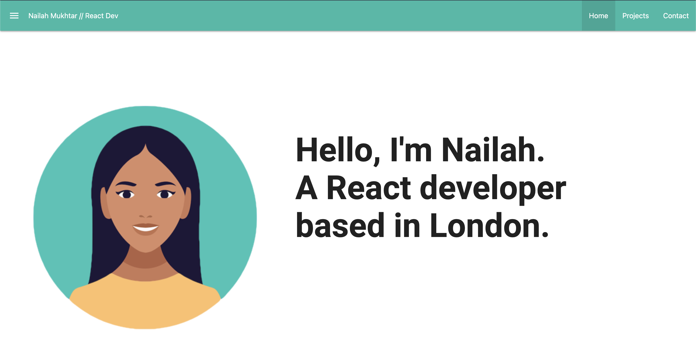

# React-Portfolio

My personal portfolio website built using React.

Description
Purpose
Build a single page application portfolio website using React to showcase what I have learnt.

What I did

When the page is loaded the website presents the following:
A hero section with my name, an avatar and some text introducing myself with sections about my projects and how to contact me.
When the links in the navigation are clicked, the UI displays that "page".
I used React router to facilitate the changing pages as you click links in the navbar.

Usage
This is a screenshot of the website.

[Project Website](https://nailahmukhtar.github.io/react-portfolio)

Credits
Assignment provided by © 2022 edX Boot Camps LLC

License
Not Applicable.